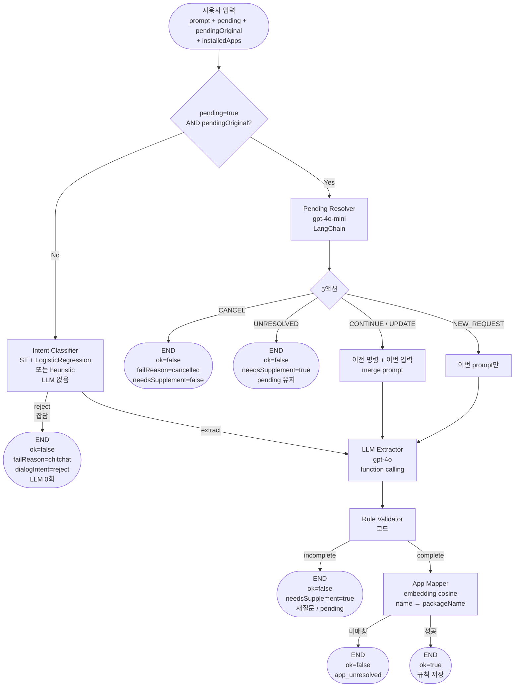

### Version 03 전체 과정

```mermaid
flowchart TD
  START([사용자 입력<br/>prompt + pending + pendingOriginal<br/>+ installedApps]) --> P{pending=true<br/>AND pendingOriginal?}

  P -->|Yes| PR[Pending Resolver<br/>gpt-4o-mini<br/>LangChain]
  P -->|No| IC[Intent Classifier<br/>ST + LogisticRegression<br/>또는 heuristic<br/>LLM 없음]

  PR --> A{5액션}
  A -->|CANCEL| C1([END<br/>ok=false<br/>failReason=cancelled<br/>needsSupplement=false])
  A -->|UNRESOLVED| C2([END<br/>ok=false<br/>needsSupplement=true<br/>pending 유지])
  A -->|CONTINUE / UPDATE| M[이전 명령 + 이번 입력<br/>merge prompt]
  A -->|NEW_REQUEST| N[이번 prompt만]

  IC -->|reject<br/>잡담| R([END<br/>ok=false<br/>failReason=chitchat<br/>dialogIntent=reject<br/>LLM 0회])
  IC -->|extract| E

  M --> E[LLM Extractor<br/>gpt-4o<br/>function calling]
  N --> E

  E --> V[Rule Validator<br/>코드]
  V -->|incomplete| ASK([END<br/>ok=false<br/>needsSupplement=true<br/>재질문 / pending])
  V -->|complete| MAP[App Mapper<br/>embedding cosine<br/>name → packageName]
  MAP -->|미매칭| U([END<br/>ok=false<br/>app_unresolved])
  MAP -->|성공| OK([END<br/>ok=true<br/>규칙 저장])
```

### Docker
> 앱 + 라이브러리 + 실행 방법을 상자에 넣어, 어디든 같은 방식으로 돌리게 하는 도구임.

현재 V3는 `sentence-transformers`와 같은 것들로 인해 {}**의존성이 무거워**{}, EC2에 수동 pip보다는 **Docker로 묶는 것**이 좋다고 결정함.