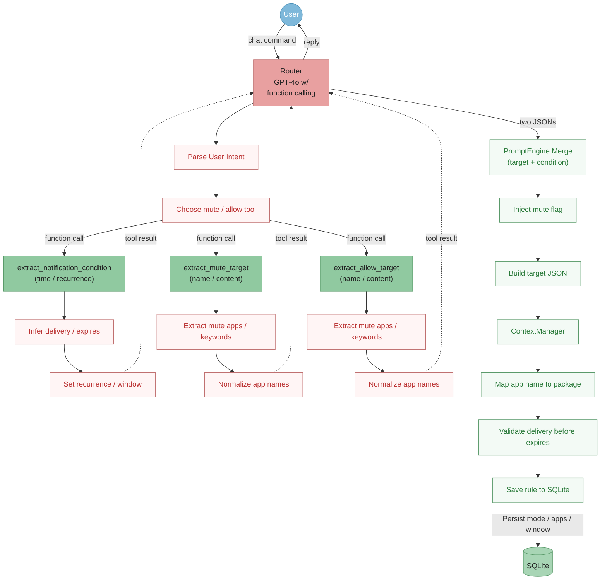

## Schedule

<table>
  <thead>
    <tr>
      <th style="text-align:center;">순서</th>
      <th>할 일</th>
      <th>핵심 산출물</th>
      <th>키우는 역량</th>
    </tr>
  </thead>
  <tbody>
    <tr style="background-color: rgba(255, 215, 0, 0.18);">
      <td style="text-align:center;"><small><strong>1</strong></small></td>
      <td><small>현재 시스템 Baseline 고정</small></td>
      <td><small>v1 구조/성능 기준</small></td>
      <td><small>System Design</small></td>
    </tr>
    <tr style="background-color: rgba(255, 215, 0, 0.18);">
      <td style="text-align:center;"><small><strong>2</strong></small></td>
      <td><small>Evaluation Dataset 구축</small></td>
      <td><small>Ground Truth Dataset</small></td>
      <td><small>LLM Evaluation</small></td>
    </tr>
    <tr>
      <td style="text-align:center;"><small><strong>3</strong></small></td>
      <td><small>자동 Evaluation 구현</small></td>
      <td><small>평가 코드 + 지표</small></td>
      <td><small>AI Engineering</small></td>
    </tr>
    <tr>
      <td style="text-align:center;"><small><strong>4</strong></small></td>
      <td><small>Error Analysis</small></td>
      <td><small>실패 유형/원인</small></td>
      <td><small>Problem Solving</small></td>
    </tr>
    <tr>
      <td style="text-align:center;"><small><strong>5</strong></small></td>
      <td><small>구조/Prompt 개선</small></td>
      <td><small>v2</small></td>
      <td><small>LLM Engineering</small></td>
    </tr>
    <tr>
      <td style="text-align:center;"><small><strong>6</strong></small></td>
      <td><small>LangGraph 도입 검토</small></td>
      <td><small>Stateful Agent</small></td>
      <td><small>Agent Engineering</small></td>
    </tr>
    <tr>
      <td style="text-align:center;"><small><strong>7</strong></small></td>
      <td><small>재평가 + 통계 검증</small></td>
      <td><small>v1 vs v2 결과</small></td>
      <td><small>Experimentation</small></td>
    </tr>
    <tr>
      <td style="text-align:center;"><small><strong>8</strong></small></td>
      <td><small>Reliability 강화</small></td>
      <td><small>Retry/Fallback/Validation</small></td>
      <td><small>Production AI</small></td>
    </tr>
    <tr>
      <td style="text-align:center;"><small><strong>9</strong></small></td>
      <td><small>실제 사용자 배포</small></td>
      <td><small>테스트 사용자</small></td>
      <td><small>Product Engineering</small></td>
    </tr>
    <tr>
      <td style="text-align:center;"><small><strong>10</strong></small></td>
      <td><small>Analytics/Crashlytics 분석</small></td>
      <td><small>실사용 데이터</small></td>
      <td><small>Product Analytics</small></td>
    </tr>
    <tr>
      <td style="text-align:center;"><small><strong>11</strong></small></td>
      <td><small>사용자 실험/A-B Test</small></td>
      <td><small>Product 효과 검증</small></td>
      <td><small>Experiment Design</small></td>
    </tr>
    <tr>
      <td style="text-align:center;"><small><strong>12</strong></small></td>
      <td><small>최종 포트폴리오 정리</small></td>
      <td><small>GitHub/Portfolio</small></td>
      <td><small>취업</small></td>
    </tr>
  </tbody>
</table>

## Baseline Architecture
* {}**Mermaid**{} 목적 : Evaluation 시, {}**어느 Component에서 문제가 발생하는지 특정**{}하기 위함

## Evaluation
* 목적 : NotiLLM이 실제로 얼마나 잘 작동하는지를 객관적으로 측정하고, {}**어디가 부족한지 찾아 개선**{}하기 위함 
  * 참고 자료 : [**DeepLearningAI**](https://www.deeplearning.ai/courses/evaluating-ai-agents?utm_source=chatgpt.com)

### Function Calling이 현재 출력하는 JSON 필드

<!-- LEFT : 50% WIDTH / 100% HEIGHT -->

extract_notification_condition

<pre class="schema-tool-pre"><code>{
  "name": "extract_notification_condition",
  "parameters": {
    "type": "object",
    "additionalProperties": false,
    "properties": {
      "delivery": {
        "type": "object",
        "additionalProperties": false,
        "properties": {
          "absolute": { "type": "string" }
        },
        "required": ["absolute"]
      },
      "activity": {
        "type": ["string", "null"]
      },
      "location": {
        "type": ["string", "null"]
      },
      "expires": {
        "type": "object",
        "additionalProperties": false,
        "properties": {
          "absolute": { "type": "string" }
        },
        "required": ["absolute"]
      },
      "recurrence": {
        "type": "string",
        "enum": ["none", "daily", "weekly"]
      },
      "days_of_week": {
        "type": "array",
        "items": {
          "type": "integer"
        }
      },
      "window_start": {
        "type": ["string", "null"]
      },
      "window_end": {
        "type": ["string", "null"]
      }
    },
    "required": [
      "delivery",
      "activity",
      "location",
      "expires",
      "recurrence",
      "days_of_week",
      "window_start",
      "window_end"
    ]
  }
}</code></pre>

<!-- RIGHT : 50% WIDTH -->

<!-- RIGHT TOP : 50% HEIGHT -->

extract_mute_target

<pre class="schema-tool-pre"><code>{
  "name": "extract_mute_target",
  "parameters": {
    "type": "object",
    "additionalProperties": false,
    "properties": {
      "name": {
        "type": "array",
        "items": {
          "type": ["string", "null"]
        }
      },
      "content": {
        "type": "array",
        "items": {
          "type": ["string", "null"]
        }
      }
    },
    "required": [
      "name",
      "content"
    ]
  }
}</code></pre>

<!-- RIGHT BOTTOM : 50% HEIGHT -->

extract_allow_target

<pre class="schema-tool-pre"><code>{
  "name": "extract_allow_target",
  "parameters": {
    "type": "object",
    "additionalProperties": false,
    "properties": {
      "name": {
        "type": "array",
        "items": {
          "type": ["string", "null"]
        }
      },
      "content": {
        "type": "array",
        "items": {
          "type": ["string", "null"]
        }
      }
    },
    "required": [
      "name",
      "content"
    ]
  }
}</code></pre>

### 1. Condition Evaluation
- 평가 영역 : `delivery`, `expires`, `activity`, `loaction`, `recurrence`, `days_od_week`, `window_start`, `window_end`

### 2. Target Evaluation
- 평가 영역 : `name`, `content`, `Tool Selection Accuracy`
- {}**Tool Selection Accuracy**{}
  - mute 요청인데 정말 `extract_mute_target`을 호출했는가?
  - allow 요청인데 정말 `extract_allow_target`을 호출했는가?

### 3. Merge Logic Evaluation
- 평가 영역 : `TargetFixed`

[**GPT 답변 내용**](https://chatgpt.com/share/6a7b6ba5-e430-83ee-8772-8a2b18b7b8e4)