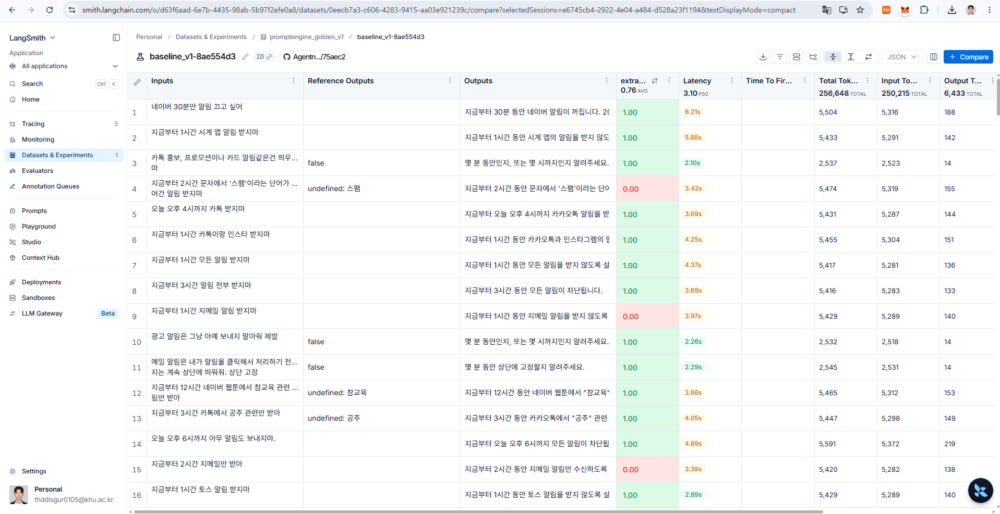

## Evaluation 설명
기존 시스템은 Kotlin 기반 Android 앱 내부의 PromptEngine.kt에서 자연어 입력을 LLM에 전달하고, Function Calling 결과를 바탕으로 알림 규칙을 생성하는 구조였다.

하지만 Android 플랫폼 로직과 LLM Extraction 로직이 하나의 코드에 강하게 결합되어 있어, {}**LLM 성능만 독립적으로 평가하거나 Prompt 변경에 따른 성능 변화를 반복적으로 검증하기 어려운 구조**{}였다.

이에 기존 PromptEngine.kt에서 수행하던 자연어 조건 추출 로직을 분리하여, {}**FastAPI + LangChain 기반의 AI Backend**{}로 이전하였다.

이를 통해 Android 앱은 사용자 입력을 AI Backend로 전달하고 결과를 받아 실제 알림 규칙으로 저장하는 역할에 집중하고, AI Backend에서는 LLM 호출, Function Calling, 결과 후처리 및 Evaluation을 독립적으로 수행할 수 있도록 구조를 분리하였다.

### FastAPI 기반 AI Backend 부분 설명
FastAPI 기반 AI Backend의 핵심 로직은 크게 {}**다음 4단계**{}로 구성하였다.

1. 시스템 프롬프트 few shot learning 관련 코드
2. 현재 시간을 지정해 function calling용 Tool Schema 리스트를 return 해주는 코드
3. LLM의 추론으로 반환된 Function Calling 결과를 내 서비스에서 사용하기 쉽도록 후처리하는 코드
4. {}**메인 처리 로직**{} : (사용자 프롬프트, 현재 시간) 입력 -> (targetFixed, condition 포함한 Response Json) 반환

* AI Backend 코드에 대한 Kotlin 연결부 : FastAPI LLM 서버에 요청하고 결과를 기존 Android 규칙 시스템에 연결

### LangSmith를 활용한 LLM 실행 추적
* LangSmith를 활용해서 {}**현재 LangChain 기반 LLM Function Calling을 추적**{}했다.


> `handle` 함수안의 두 `ChatOpenAI.invoke` 함수를 자동으로 추적하고 있는 것을 확인할 수 있었다!

### Code-based Evaluation 설계 과정
- `evals` 폴더 생성 후, 평가에 사용할 샘플 5개 **JSON 데이터셋(input, output)** 생성
- `dataset_upload.py` : Jsonl 확장자 파일에서 정의한 데이터셋을 **LangSmith Dataset**에 업로드
- `System Few Shot` 부분도 전체적으로 어떻게 프롬프팅 했는지 점검해봐야 함.
- `evaluators.py` 파일과 `run_experiment.py` 파일 생성해서 LangSmith 기반 테스트 진행함. (정답률 : 100%, 샘플 5개 적용)

### Evaluators.py 코드에 대해서..

```python
def extract_rule_correctness(
    outputs: dict,
    reference_outputs: dict,
) -> dict:
    
    """
    ExtractRule JSON 정답 일치도 (binary code metric).
    LangSmith evaluate()가 Example마다 호출:
      outputs            ← Target(handle) 반환값
      reference_outputs  ← Dataset example.outputs
    Returns:
      key/score 형태 dict — UI 지표명과 0~1 점수
      comment — 필드별 pass/fail (디버깅용)

    delivery/expires 는 currentTime이 고정이므로 ISO 문자열 exact match.
    """
    
    pred = outputs or {}
    exp = reference_outputs or {}
    checks: dict[str, bool] = {}

    # ok (성공/실패) — router 성격
    checks["ok"] = bool(pred.get("ok")) == bool(exp.get("ok"))

    # 정답이 실패면 구조 필드 없음 → ok만 채점
    # 예: "카톡만 받아줘" (시간 없음) → ok=false
    if not exp.get("ok"):
        return {
            "key": "extract_rule_correctness",
            "score": 1.0 if checks["ok"] else 0.0,
            "comment": str(checks),
        }

    # 성공 정답 → targetFixed / condition 필드 비교
    # 정답에 있는 키만 검사 (부분 reference 허용)
    pt = pred.get("targetFixed") or {}
    et = exp.get("targetFixed") or {}
    pc = pred.get("condition") or {}
    ec = exp.get("condition") or {}

    if "mute" in et:
        checks["mute"] = bool(pt.get("mute")) == bool(et.get("mute"))
    if "name" in et:
        checks["name"] = _as_set(pt.get("name")) == _as_set(et.get("name"))
    if "content" in et:
        checks["content"] = _as_set(pt.get("content")) == _as_set(et.get("content"))
    if "recurrence" in ec:
        checks["recurrence"] = pc.get("recurrence") == ec.get("recurrence")
    if "delivery" in ec:
        checks["delivery"] = _abs(pc.get("delivery")) == _abs(ec.get("delivery"))
    if "expires" in ec:
        checks["expires"] = _abs(pc.get("expires")) == _abs(ec.get("expires"))

    passed = all(checks.values()) if checks else False

    return {
        "key": "extract_rule_correctness",
        "score": 1.0 if passed else 0.0,
        "comment": str(checks),
    }
```

- `LangSmith`에서 `Target(handle)` 반환값과 `Dataset example.outputs` 의 결과값을 비교해 `0, 1` 점(binary)으로 수치화함.
- `handle` 함수의 결과값 JSON 필드는 예상과 정확하게 나와야 하기 때문에, {}**Code Based Evaluation**{} 을 진행함.

### Dataset 생성
- 예전 학부연구생 생활하면서, 같은 연구실 동기들에게 받은 32개의 예시에는 `ok=False`가 너무 많아 평가가 편향될 것으로 예상되어, 10개로 줄였다.
- `ok = True` 는 40개 / `ok = False` 는 10개로 개수를 맞춰 테스트를 진행할 예정이다.
- 본 Evaluation에서는 사용자 자연어 요청으로부터 앱, 콘텐츠, 알림 허용/차단 및 시간 조건을 구조화된 JSON으로 정확하게 추출하는지를 검증하며, {}**콘텐츠의 의미적 분류 정확도는 평가 범위에서 제외**{}한다.


- 의미적 분류 정확도는 현재 오류로 검증하지 않았지만, **개선 사항**임.
- `extra_rule_correctness` = 0.76 : 왜 이 테스트 결과값이 나왔는지 점검 해봐야 한다.