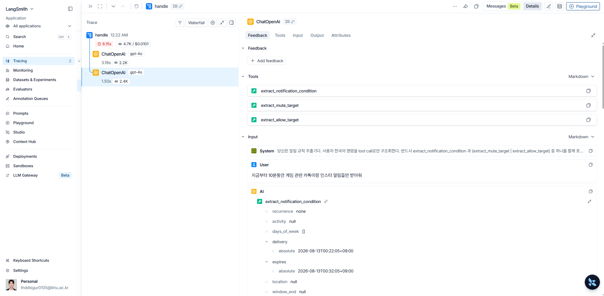

## Evaluation 설명
기존 시스템은 Kotlin 기반 Android 앱 내부의 PromptEngine.kt에서 자연어 입력을 LLM에 전달하고, Function Calling 결과를 바탕으로 알림 규칙을 생성하는 구조였다.

하지만 Android 플랫폼 로직과 LLM Extraction 로직이 하나의 코드에 강하게 결합되어 있어, {}**LLM 성능만 독립적으로 평가하거나 Prompt 변경에 따른 성능 변화를 반복적으로 검증하기 어려운 구조**{}였다.

이에 기존 PromptEngine.kt에서 수행하던 자연어 조건 추출 로직을 분리하여, {}**FastAPI + LangChain 기반의 AI Backend**{}로 이전하였다.

이를 통해 Android 앱은 사용자 입력을 AI Backend로 전달하고 결과를 받아 실제 알림 규칙으로 저장하는 역할에 집중하고, AI Backend에서는 LLM 호출, Function Calling, 결과 후처리 및 Evaluation을 독립적으로 수행할 수 있도록 구조를 분리하였다.

### FastAPI 기반 AI Backend 부분 설명
FastAPI 기반 AI Backend의 핵심 로직은 크게 {}**다음 4단계**{}로 구성하였다.

1. 시스템 프롬프트 few shot learning 관련 코드
2. 현재 시간을 지정해 function calling용 Tool Schema 리스트를 return 해주는 코드
3. LLM의 추론으로 반환된 Function Calling 결과를 내 서비스에서 사용하기 쉽도록 후처리하는 코드
4. {}**메인 처리 로직**{} : (사용자 프롬프트, 현재 시간) 입력 -> (targetFixed, condition 포함한 Response Json) 반환

* AI Backend 코드에 대한 Kotlin 연결부 : FastAPI LLM 서버에 요청하고 결과를 기존 Android 규칙 시스템에 연결

### LangSmith를 활용한 LLM 실행 추적
* LangSmith를 활용해서 {}**현재 LangChain 기반 LLM Function Calling을 추적**{}했다.

> `handle` 함수안의 두 `ChatOpenAI.invoke` 함수를 자동으로 추적하고 있는 것을 확인할 수 있었다!