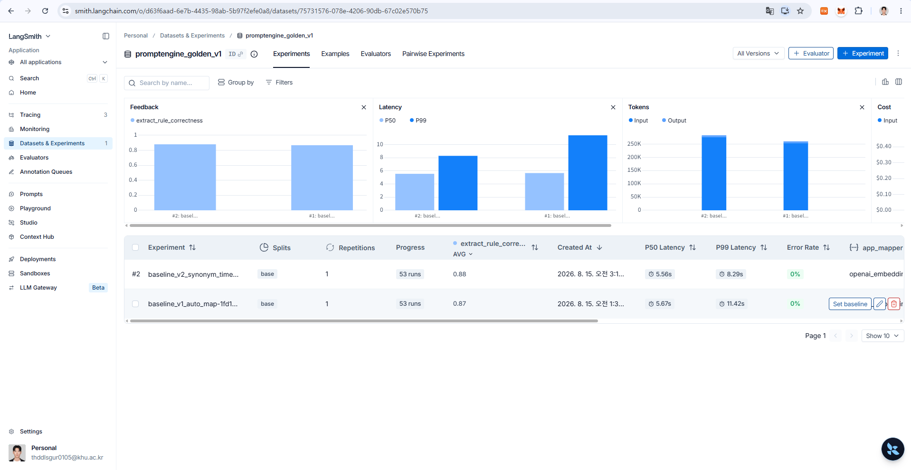

LangSmith를 기반으로 53문항의 테스트를 진행했고, 개선 수행.

[**BLINK 논문**](https://arxiv.org/abs/1911.03814)에서는 여러 앱의 메타데이터도 같이 넣어서, context기반 cosine 유사도 계산 방식을 추천했으나, 메타데이터를 불러올 적절한 방법을 찾지 못함.
- 앱 관련 시스템 정보에는 메타데이터가 존재하지 않았음. 전부 `null` 필드.
- Google Play Store에서 API 형태로 앱의 Description을 가져오는 것도 생각해 보았으나, 서비스가 너무 무거워질 것으로 예상되어 {}**유의어 사전을 만드는 방식을 채택함.**{}

## 코드 개선 전, Baseline 테스트 결과
- 총 53개 테스트 데이터
- 정답률 : {}**0.87**{}

## Error Case 1.
> [!success] "카톡 2분만 받지마"
- output
    - "ok": false
- ground truth
    - 현재 시간부터 2분동안 카톡을 받지 않도록 설정함.
- 피드백
    - 시스템 프롬프트에 현재 시간이 정의되어 있지 않으면 현재 시간 부터라는 내용을 추가해 넣어줘야 할 거 같음.

## Error Case 2.
> [!success] "지금부터 1시간 문자만 받아줘"
- output
    - 문자 앱이 아닌 com.samsung.android.mdecservice 다른 앱의 cosine 유사도가 가장 높았고, 이 마저도 0.5 이하여서 ok=false 반환.
- ground truth
    - packages에 "com.samsung.android.messaging"이 담겨야 함.
- 피드백
    - Cosine 유사도 판단 오류. "문자"와 "메시지"의 코사인 유사도가 낮게 나옴.

## Error Case 3.
> [!warning] "지금부터 2시간 문자 스팸 알림 받지마"
- output
    - name 필드는 비어있고, content=["문자", "스팸"]
- ground truth
    - name="메시지", content="스팸" 이 담겨야 함.
- 피드백
    - 스팸이 name인지 앞서 나온 "문자"에 대한 "스팸"인지 확인할 수 있어야 함.

## Error Case 4.
> [!success] "지금부터 2시간 문자에서 '스팸'이라는 단어가 들어간 알림 받지마"
- output
    - 문자 앱이 아닌 com.samsung.android.mdecservice 다른 앱의 cosine 유사도가 가장 높았고, 이 마저도 0.5 이하여서 ok=false 반환.
- ground truth
    - packages에 "com.samsung.android.messaging"이 담겨야 함.
- 피드백
    - Cosine 유사도 판단 오류. "문자"와 "메시지"의 코사인 유사도가 낮게 나옴.

## Error Case 5.
> [!success] "지금부터 2시간 플레이스토어 업데이트 알림 받지마"
- output
    - com.android.vending 앱이 아닌 com.samsung.android.smartsuggestions 다른 앱의 cosine 유사도가 가장 높았음. 즉, 잘못된 앱의 이름을 설정함.
- ground truth
    - packages에 "com.android.vending"이 담겨야 함.
- 피드백
    - Cosine 유사도 판단 오류.

## Error Case 5. [제외 케이스]
> [!warning] "지금부터 12시간 카톡 홍보, 프로모션이나 카드 알림은 띄우지마"
- output
    - name="카카오톡", content="홍보, 프로모션, 카드" 가 들어감.
- ground truth
    - 현재 구조로는 해결이 불가능. ok=false
- 피드백
    - 아직 해결 불가능.

## Error Case 6.
> [!warning] "지금부터 5분 카톡 메세지 알림 받지마"
- output
    - name="카카오톡", content="메세지" 가 들어감.
- ground truth
    - "카톡 메세지" 라고 말을 해도, 사실상 "카톡"을 의미하는 것이므로, name="카카오톡" 이고 content는 비워야 함.
- 피드백
    - 추출 오류.


{}**문제점**{}
- "다른 기기에서도 전화/문자하기"("com.samsung.android.mdecservice") 와 "메시지"("com.samsung.android.messaging")가 있을 때, "문자"라는 단어가 "메시지"에 매핑되도록 하려면 어떻게 해야 하나?
- "퍼스널 데이터 인텔리전스"("com.samsung.android.smartsuggestions") 와 "Play 스토어"("com.android.vending")가 있을 때, "플레이스토어"라는 단어가 "Play 스토어"에 매핑되도록 하려면 어떻게 해야 하나?

{}**나의 해결책**{}
- 처음에는 [Android Developer](https://developer.android.com/reference/android/content/pm/ApplicationInfo) 사이트에서 관련 메타데이터를 찾을 수 있는 방법을 고민함.
    - 하지만 {}**해당 필드가 전부 비어있는 값으로 나와 사용할 수 없었음.**{}
    - 따라서 {}**유의어 사전**{}을 만드는 방법을 채택함.
        1. LLM이 뽑은 **앱 이름(name, "문자")**으로 찾음
        2. 유의어 사전에 그 그룹 단어를 ["문자", "메시지", "SMS", ...] 로 확장
        3. (확장된 각 단어) X (설치 앱 각 라벨) : Cosine
        4. 각 앱마다 그 중 가장 높은 점수로 대표
        5. 전 앱 중 최고 + Threshold 로 최종 package 결정

- 시스템 프롬프트 **few-shot learning** 추가
```python
...
- **"N분(만/동안/간) …" 처럼 기간만 있고 시작 시각이 없으면 → 지금부터. delivery=현재, expires=현재+N분**
  - 예: "카톡 2분만 받지마", "카톡 5분동안 받지마" 모두 현재부터.
...
```

## 코드 개선 이후
- 정답률 : {}**0.88**{}
    - 오히려 다른 부분에서 정답이 오답으로 수정된 케이스가 생김. (뭐지...)