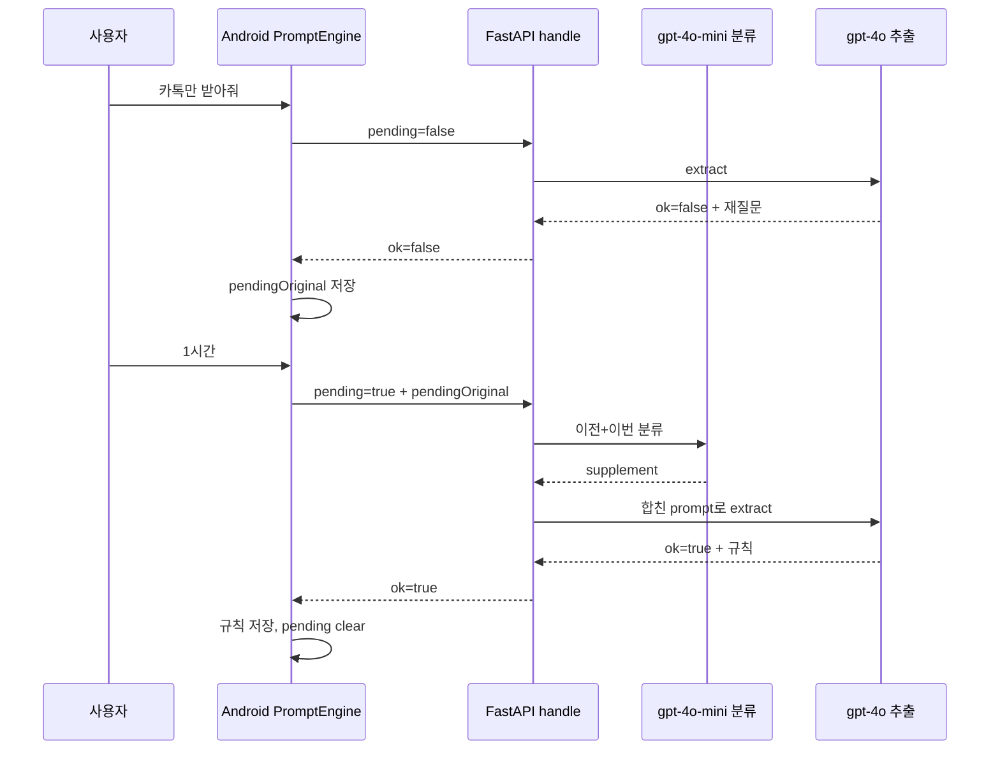

## backend/app/pending.py 추가

{}**Sequence Diagram**{}

### `classify_pending_turn` 함수
재질문 대기 중일 때, {}**이번 입력이 보충인지 새 명령인지 LLM으로 판별**{}한다.
- `pending_original`: 재질문 전 사용자 명령
- `current_prompt`: 재질문 후 사용자 입력
- `supplement`: 이전 명령에 대한 보충 (예: 1시간)
- `new_command`: 이전과 무관한 새 규칙

### `resolve_extract_prompt` 함수
handle 앞에서 {}**추출용 prompt 문자열을 만드는 진입점**{} 역할을 한다.
- `prompt`: 이번 사용자 입력
- `pending`: 앱이 보낸 재질문 대기 여부
- `pending_original`: 재질문 전 원문
- `(extract_prompt, classification)`: 추출 LLM에 넣을 문장 + 분류 결과 [None: 분류 안함]

> [!todo] 추가 재질문 (Pending 처리) LLM이 실 기기에서 동작하는 지에 대한 테스트 진행 필요