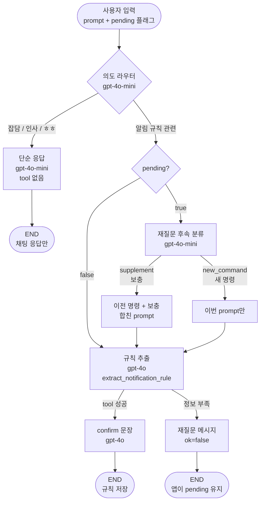

## `LangGraph` 도입하는 게 맞을까?

`LangGraph`를 {}**비용 최적화**{}를 위해 도입하는 게 좋을 거 같음.
- 현재 `version`은 ChatGPT 4o 모델을 활용해 사용자 자연어 처리를 함.
  - 현재 얼마의 비용이 청구되는 지에 대한 정확한 판단이 필요함. {}**문제 설정 필요**{}
  - 하지만 사용자 명령이 만약 **안녕**, **ㅎ2**, **ㅎㅎ** 라면? {}**굳이 모든 명령들을 전부 `4o` 모델로 처리할 필요가 있을까??**{}
  - 사용자의 명령을 `중요도 낮음`, `약간 중요`, `매우 중요` 등으로 나눠서, 이에 맞는 수준의 모델로 라우팅해주는 게 좋을 거 같음.

## 참조 연구들

1. [ReAct](https://arxiv.org/abs/2210.03629?utm_source=chatgpt.com)
  - `Reasoning`과 `Action`을 번갈아 수행하면서 외부 환경 / 도구와 상호작용하는 구조

2. [Self-Refine](https://papers.neurips.cc/paper_files/paper/2023/hash/91edff07232fb1b55a505a9e9f6c0ff3-Abstract-Conference.html?utm_source=chatgpt.com)
  - 같은 LLM이 `Generator`, `Feedback Provider`, `Refiner` 역할을 수행하면서 반복적으로 결과 개선
  - 별도의 `Supervised Training`이나 `RL` 없이도 **여러 task에서 one-shot generation보다 성능 개선** 보고

3. [Reflexion](https://arxiv.org/abs/2303.11366)
  - **자연어 `reflection` 형태로 `memory`에 저장**하고 다음 `attempt`에 활용하는 구조
  - `LangGraph`에서 `state` / `memory` / `retry loop`를 설계할 때 굉장히 자연스럽게 연결

4. [CRITIC](https://proceedings.iclr.cc/paper_files/paper/2024/hash/fef126561bbf9d4467dbb8d27334b8fe-Abstract-Conference.html?utm_source=chatgpt.com)
  - **틀린 모델이 자기 답을 평가**하면 틀릴 수 있음.
  - 검색엔진, 코드 실행기 같은 **외부 도구의 피드백을 사용해 검증**

5. [Tree of Thoughts](https://proceedings.neurips.cc/paper/2023/hash/271db9922b8d1f4dd7aaef84ed5ac703-Abstract.html?utm_source=chatgpt.com)
  - 여러 `reasoning candidate`를 만들고 평가하면서 `search` / `branching` / `backtracking`

6. [Plan-and-Solve](https://aclanthology.org/2023.acl-long.147/?utm_source=chatgpt.com)
  - 전체 문제를 먼저 작은 `subtask`로 나눈 뒤 실행
  - 특히 `Zero-shot CoT`에서 발생하는 `missing-step` 등의 문제를 해결하려는 접근

7. [ReWOO](https://arxiv.org/abs/2305.18323?utm_source=chatgpt.com)
  - `reasoning`과 `tool observation`을 **분리**

8. [Toolformer](https://proceedings.neurips.cc/paper_files/paper/2023/hash/d842425e4bf79ba039352da0f658a906-Abstract-Conference.html?utm_source=chatgpt.com)
  - `Tool Calling`의 중요한 초기 연구
  - **LLM이 언제 어떤 API를 사용할지를 결정**하는 것 자체를 연구한 논문

9. [AutoGen](https://arxiv.org/abs/2308.08155?utm_source=chatgpt.com)
  - 같은 여러 `Agent` 간 `interaction`을 일반화한 프레임워크 연구
  - `LLM`, `human input`, `tool`을 조합한 `customizable/conversable agen`t를 구성하고 다양한 `conversation pattern`을 정의