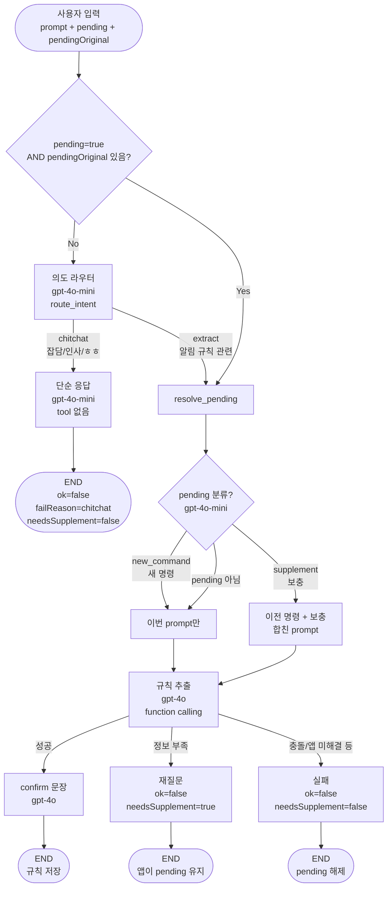

## `LangGraph` 도입하는 게 맞을까?

`LangGraph`를 {}**비용 최적화**{}를 위해 도입하는 게 좋을 거 같음.
- 현재 `version`은 ChatGPT 4o 모델을 활용해 사용자 자연어 처리를 함.
  - 현재 얼마의 비용이 청구되는 지에 대한 정확한 판단이 필요함. {}**문제 설정 필요**{}
  - 하지만 사용자 명령이 만약 **안녕**, **ㅎ2**, **ㅎㅎ** 라면? {}**굳이 모든 명령들을 전부 `4o` 모델로 처리할 필요가 있을까??**{}
  - 사용자의 명령을 `중요도 낮음`, `약간 중요`, `매우 중요` 등으로 나눠서, 이에 맞는 수준의 모델로 라우팅해주는 게 좋을 거 같음. {}**나중에 구현할 기능**{}

### Version 01.


### Version 02.


## LangGraph 도입을 통해 `Routing 버전`을 추가했을 때, 확인해야 하는 것들
- A버전에 비해 B버전에서, **정확도**가 많이 떨어지지 않는지
- **비용 및 속도**가 얼마나 줄어드는지


## Dataset 기준 설정

### 축 A. `intent`
정답 `outputs.ok`와 `mute/allow`로 결정

| 값 | 조건 | 예시 |
|---|---|---|
| `mute` | `ok=true`, `targetFixed.mute=true` | "카톡 5분 받지마" |
| `allow` | `ok=true`, `targetFixed.mute=false` | "1시간 카톡만 받아" |
| `reject` | `ok=false` | "카톡만 받아줘" (시간 없음) |

```json
"metadata": { "intent": "reject" }
```

### 축 B. `time`
정답 `condition`으로 결정

| 값 | 조건 | 예시 |
|---|---|---|
| `duration` | `recurrence=none`, N분/N시간 구간 | "30분 받지마" |
| `until_absolute` | 특정 시각까지 | "오후 6시까지" |
| `relative_delay` | 시작이 "N분 후" | "3분 후부터 5분동안" |
| `daily` | `recurrence=daily` | "매일 밤 10시~6시" |
| `weekly` | `recurrence=weekly` | "월수금 2~5시" |

- **규칙**: `recurrence`가 `daily/weekly`면 `duration`이 아님.
- 같은 문장이라도 currentTime만 다르면 별도 문항

### 축 C. `target`
정답 `targetFixed`으로 결정

| 값 | 조건 | 예시 |
|---|---|---|
| `all` | `name`, `packages`, `content` 모두 빈 배열 | "모든 알림 받지마" |
| `single_app` | 앱 1개 | "카톡 받지마" |
| `multi_app` | 앱 2개 이상 | "카톡이랑 인스타만" |
| `content` | `content`만 있거나 content가 핵심 | "광고 알림 받지마" |
| `app_and_content` | 앱 + 키워드 둘 다 | "카톡에서 게임 관련만" |

- 별도 `alias` 축은 안 써도 됨

### 축 D. `route`
> [!note] 아직 미구현
추출 정답이 아니라 **“이 문항에 어떤 모델을 쓰는 게 맞나”** 라벨.

| 값 | 규칙 (우선순위 위에서 아래) |
|---|---|
| `hard` | `time` ∈ {`daily`, `weekly`} 또는 overnight 회차 |
| `medium` | `intent=reject` 또는 `target` ∈ {`multi_app`, `app_and_content`, `content`} 또는 `until_absolute` / `relative_delay` |
| `easy` | 그 외 (`duration` + `single_app` / `all`, `ok=true`) |

### 데이터셋 정리
| 축                           | 값                 | 개수 | 기준 |  상태 |
| --------------------------- | ----------------- | -: | -: | :-: |
| **A. intent**               | `mute`            | 44 | ≥5 |  OK |
| **A. intent**               | `allow`           | 14 | ≥5 |  OK |
| **A. intent**               | `reject`          | 27 | ≥5 |  OK |
| **B. time (ok=true 58건)**   | `duration`        | 38 | ≥5 |  OK |
| **B. time**                 | `until_absolute`  |  5 | ≥5 |  OK |
| **B. time**                 | `relative_delay`  |  5 | ≥5 |  OK |
| **B. time**                 | `daily`           |  5 | ≥5 |  OK |
| **B. time**                 | `weekly`          |  5 | ≥5 |  OK |
| **C. target (ok=true 58건)** | `all`             | 11 | ≥5 |  OK |
| **C. target**               | `single_app`      | 29 | ≥5 |  OK |
| **C. target**               | `multi_app`       |  5 | ≥5 |  OK |
| **C. target**               | `content`         |  6 | ≥5 |  OK |
| **C. target**               | `app_and_content` |  7 | ≥5 |  OK |


## 참조 연구들

1. [ReAct](https://arxiv.org/abs/2210.03629?utm_source=chatgpt.com)
  - `Reasoning`과 `Action`을 번갈아 수행하면서 외부 환경 / 도구와 상호작용하는 구조

2. [Self-Refine](https://papers.neurips.cc/paper_files/paper/2023/hash/91edff07232fb1b55a505a9e9f6c0ff3-Abstract-Conference.html?utm_source=chatgpt.com)
  - 같은 LLM이 `Generator`, `Feedback Provider`, `Refiner` 역할을 수행하면서 반복적으로 결과 개선
  - 별도의 `Supervised Training`이나 `RL` 없이도 **여러 task에서 one-shot generation보다 성능 개선** 보고

3. [Reflexion](https://arxiv.org/abs/2303.11366)
  - **자연어 `reflection` 형태로 `memory`에 저장**하고 다음 `attempt`에 활용하는 구조
  - `LangGraph`에서 `state` / `memory` / `retry loop`를 설계할 때 굉장히 자연스럽게 연결

4. [CRITIC](https://proceedings.iclr.cc/paper_files/paper/2024/hash/fef126561bbf9d4467dbb8d27334b8fe-Abstract-Conference.html?utm_source=chatgpt.com)
  - **틀린 모델이 자기 답을 평가**하면 틀릴 수 있음.
  - 검색엔진, 코드 실행기 같은 **외부 도구의 피드백을 사용해 검증**

5. [Tree of Thoughts](https://proceedings.neurips.cc/paper/2023/hash/271db9922b8d1f4dd7aaef84ed5ac703-Abstract.html?utm_source=chatgpt.com)
  - 여러 `reasoning candidate`를 만들고 평가하면서 `search` / `branching` / `backtracking`

6. [Plan-and-Solve](https://aclanthology.org/2023.acl-long.147/?utm_source=chatgpt.com)
  - 전체 문제를 먼저 작은 `subtask`로 나눈 뒤 실행
  - 특히 `Zero-shot CoT`에서 발생하는 `missing-step` 등의 문제를 해결하려는 접근

7. [ReWOO](https://arxiv.org/abs/2305.18323?utm_source=chatgpt.com)
  - `reasoning`과 `tool observation`을 **분리**

8. [Toolformer](https://proceedings.neurips.cc/paper_files/paper/2023/hash/d842425e4bf79ba039352da0f658a906-Abstract-Conference.html?utm_source=chatgpt.com)
  - `Tool Calling`의 중요한 초기 연구
  - **LLM이 언제 어떤 API를 사용할지를 결정**하는 것 자체를 연구한 논문

9. [AutoGen](https://arxiv.org/abs/2308.08155?utm_source=chatgpt.com)
  - 같은 여러 `Agent` 간 `interaction`을 일반화한 프레임워크 연구
  - `LLM`, `human input`, `tool`을 조합한 `customizable/conversable agen`t를 구성하고 다양한 `conversation pattern`을 정의