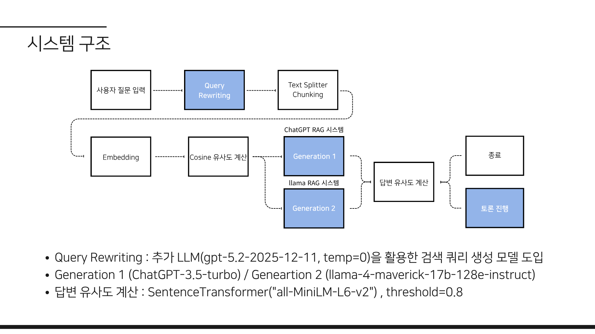

#### 📄 Paper

> **멀티 모델을 활용한 RAG Generation 단계 환각 탐지**

📑 [Research Paper (PDF)](https://drive.google.com/file/d/1lJwaTsDuXqUsFMLFv8uWvke54X24SNsS/view)

#### 🖼️ PPT

> **Graduation Project PPT**

📄 [PPT (PDF, VIDEO)](https://drive.google.com/drive/u/0/folders/15Z8gYmIFQuVdOqfj9mCIOVNfmq7--P8b)

### 요약
- **프로젝트 이름**: 멀티 모델을 활용한 RAG Generation 단계 환각 탐지
- **영문 제목**: A Multi-LLM Cross-Verification Framework for Attribution Hallucination Detection in RAG Generation
- **프로젝트 기간**: 2025.03 ~ 2025.07
- **프로젝트 설명**: 동일한 RAG 검색 문서를 기반으로 ChatGPT와 LLaMA가 독립적으로 답변을 생성하고, 유사도가 낮을 때 문서 인용 기반 상호 평가·토론을 수행하는 Generation 단계 환각 탐지 시스템
- **프로젝트 목적**: RAG Generation 단계에서 발생하는 환각을 단일 모델 검증의 한계를 넘어, 서로 다른 LLM의 답변 다양성으로 탐지하고 교정
- **검증 데이터**: TruthfulQA 중 Source가 Wikipedia인 질문 50문항
- **비교 모델**: ChatGPT-3.5-turbo, Groq 기반 llama-4-maverick-17b-128e-instruct
- **주요 검증 대상**: 최종 답변, 원본 문서 인용 문장, 근거가 답변을 지지하는 이유
- **주요 성과**: 한 모델만 오답인 문항에서 토론을 통해 약 절반을 정답으로 교정 (GPT만 오답 3문항 중 1문항, LLaMA만 오답 13문항 중 7문항)

 

### 연구를 시작하게 된 배경
기존 LLM의 환각을 개선하기 위해 RAG 기법이 도입되었지만, RAG를 활용한 LLM에서도 환각 문제는 여전히 남아 있었습니다.

> SUFFICIENT CONTEXT: A NEW LENS ON RETRIEVAL AUGMENTED GENERATION SYSTEMS (2025) 논문 일부 발췌
- RAG로 추가 맥락을 주더라도 AI의 자신감이 올라가는 것과 정확성이 항상 비례하지는 않았습니다.
- ChatGPT 4o, Gemini 1.5 Pro, Gemma 27B처럼 모델이 다르면 학습 데이터 차이로 환각률도 다르게 나타났습니다.

따라서 본 연구에서는 {}**서로 다른 언어 모델의 답변 다양성을 Generation 단계 환각 개선에 활용**{}하고자 했습니다. RAG 파이프라인 중에서도 Query Rewriting과 Generation에서 환각이 자주 발생하는데, Generation은 LLM 사용이 필수이므로 이 단계에 집중해 멀티 에이전트 구조로 분기했습니다.

### 시스템 아키텍처

- **Query Rewriting**: 추가 LLM(`gpt-5.2-2025-12-11`, temp=0)으로 검색 쿼리 생성
- **Generation 1 / 2**: ChatGPT-3.5-turbo, llama-4-maverick-17b-128e-instruct가 동일 검색 문서로 독립 답변
- **답변 유사도 계산**: SentenceTransformer(`all-MiniLM-L6-v2`), threshold=0.8
- **일치 시 종료 / 불일치 시 토론**: 상대 답변이 문서에 근거하는지 문장 직접 인용으로 상호 평가

### 토론 프롬프트 설계
각 모델은 답변 시 아래 세 가지를 함께 작성하도록 했습니다.
1. 최종 답변
2. 원본 문서 인용 문장
3. 해당 근거가 답변을 지지하는 이유

답변이 불일치하면, 상대 답변이 문서에 근거하는지를 {}**문서 문장을 직접 인용해 평가**{}하도록 지시했습니다.

### 실험 설계
1. TruthfulQA 중 Wikipedia 출처 질문 50문항 선정
2. RAG 기반 독립 답변 생성
3. 유사도 불일치 시 토론 진행
4. Best Answer / Best Incorrect Answer 기준 수동 검증

단순 사실 판단 데이터는 제외하고, 정·오답이 라벨링된 문항만 사용해 교정 효과를 수치화했습니다.

### 실험 결과
| 구분 | 문항 수 | 토론 후 |
|------|--------:|--------|
| GPT만 정답 | 3 | 정답 교정 1 / 오답 유지 2 |
| LLaMA만 정답 | 13 | 정답 교정 7 / 오답 유지 6 |
| 둘 다 오답 | 14 | 정답 교정 0 |
| 둘 다 정답 | 20 | - |

한 모델만 오답인 경우 약 절반이 토론으로 교정되었고, {}**둘 다 오답이면 토론만으로는 교정되지 않았습니다.**{}

### 유형별 분석
Misconceptions, Conspiracies, Superstitions, Paranormal, Fictions 중 **미신(Superstitions)** 문항에서 오류율이 가장 높았습니다 (GPT 0%, LLaMA 22%).

### 결론
- Generation 단계 모델만 바꿔도 성능 차이가 컸습니다.
- 한 모델만 오답일 때 토론의 교정 효과가 확인되었습니다.
- 두 모델이 모두 오답이면 RAG 토론만으로는 교정이 어려웠습니다.
- 미신 · 잘못된 상식류 문항에서 특히 취약했습니다.

### 사례
- **둘 다 정답**: Fortune cookie 기원 질문 — 유사도 0.97, Conflict False로 종료
- **한 모델만 정답 → 교정**: 식사 후 수영 대기 시간 질문 — 1차 불일치 후, 문서에 대기 시간 언급이 없다는 인용 평가로 합의 도달

### 프로젝트를 진행하며 느낀점
멀티 에이전트 챗봇 토론 시스템을 활용한 환각 교정 서비스를 개발하면서 환각 문제를 깊이 분석하던 중, 연구를 더욱 발전시킬 수 있는 새로운 방향을 발견했습니다. 일반적인 사실 오류뿐만 아니라, {}**출처 환각(Attribution Hallucination)**{} 역시 실제 서비스 환경에서 빈번하게 발생하는 중요한 문제라는 점을 알게 되었고, 이를 해결하기 위해 본 프로젝트를 진행하게 되었습니다.

본 연구에서는 각 LLM에 RAG(Retrieval-Augmented Generation) 시스템을 구축하고, 서로의 답변에 포함된 출처를 교차 검증하도록 설계하여 출처 환각을 줄이는 것을 목표로 했습니다. 다만 어떤 데이터셋을 구성해야 하는지, 출처의 일치 여부를 어떤 기준으로 검증해야 하는지 등 연구 설계 단계에서 많은 고민이 있었고, 이를 구체화하기 위해 교수님과 지속적으로 논의하며 연구 방향을 수정해 나갔습니다.

최종적으로는 Prompt Engineering과 LLM 간 대화 구조를 보다 정교하게 설계함으로써 의미 있는 성능 개선을 확인할 수 있었고, 이를 바탕으로 논문화까지 진행할 수 있었습니다. 아직 해결해야 할 한계점이 남아 있지만, 이를 보완하며 출처 환각 탐지 및 교정 성능을 더욱 향상시키는 방향으로 연구를 계속 발전시킬 계획입니다.