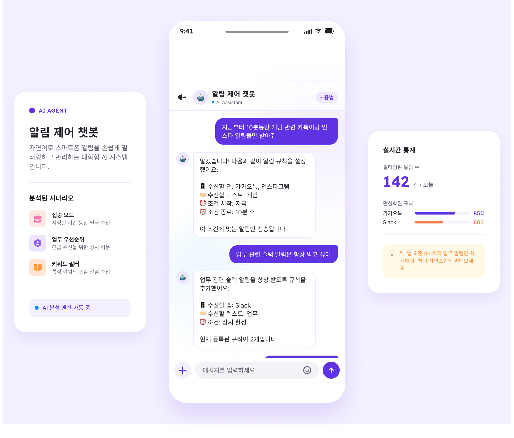

> [!WARNING] 해당 서비스는 연구실의 아이디어를 기반으로 서비스화한 것으로, 관련 저작권은 연구실에 있습니다.

> [!IMPORTANT] 정리예정 진행중입니다.

### 요약
- **프로젝트 이름**: NotiLLM
- **프로젝트 기간**: 2026.07 ~ (진행중)
- **프로젝트 설명**: LLM Agent를 실서비스로 배포하고, 수집된 사용자 데이터를 기반으로 데이터 분석
- **프로젝트 목적**: 수집된 데이터를 분석해 추가 아이디어 확장

### Problem {#problem}
- 기존 수동제어 기반 방식은 사용자의 직접 설정을 필요로 하므로, **사용자 부담이 증가**하고 사용성이 떨어집니다.
- 반대로 ML 기반 알림 수신 타이밍 예측 방식들은 정확성을 높이기 위한 연구들이 많이 진행되고 있지만, 근본적으로 사용자의 비언어적 신호를 기반으로 하기에 **예측이 부정확**합니다.
- 따라서 본 연구는 수동 제어 방식의 불편함과 모델 기반 방식의 부정확성을 둘 다 잡고 해결하기 위해, **LLM 기반 사용자 제어**를 진행합니다.

> [!NOTE] 본 서비스는 연구실의 아이디어를 실제 서비스로 확장하고, 배포 및 운영 경험을 바탕으로 후속 연구 및 서비스 고도화를 진행하기 위한 목적으로 개발되었습니다.

### 서비스 디자인
Figma를 활용해 실제 서비스에 가까운 수준으로 UI/UX를 디자인했습니다. 화면을 구성할 때는 사용성을 고려해 버튼과 텍스트의 배치를 설계하고, 사용자에게 어떤 정보를 효과적으로 제공할지 중점적으로 고민했습니다. <u>{}**[1] 특히 알림 피로가 얼마나 줄어들었는지 사용자가 직접 확인할 수 있도록 차단된 알림의 실시간 통계 기능을 추가**{}</u>했습니다. 또한 필요한 경우 <u>**[2] 모든 알림을 한 번에 확인할 수 있는 버튼을 제공**</u>하고, 홈 화면 하단에서는 <u>**[3] 수신된 알림을 앱별로 요약**</u>해 확인할 수 있도록 구성했습니다.

### 시스템 설계 확장
Function Calling을 통해 사용자의 자연어를 JSON 구조로 변환할 때는 기본 동작을 "알림을 허용(받아줘 Default)"으로 할지, "알림을 차단(받지마 Default)"으로 할지 설계 방향을 결정해야 했습니다. **연구를 진행하면서 한 가지 방식만 적용할 경우 예상하지 못한 반례가 발생한다는 점을 확인**했습니다. 이를 해결하기 위해 두 가지 기본 동작을 모두 지원하도록 Function Calling을 설계하여 다양한 명령을 유연하게 처리할 수 있도록 확장했습니다. 그 결과 {}**기존에는 처리하기 어려웠던 "매일", "평일만", "주말만"과 같은 반복 · 주기성 명령까지 안정적으로 지원**{}할 수 있었습니다.

### 느낀점
테스트를 진행하며 다양한 사용자층을 확보하는 것이 중요하다는 점을 느꼈습니다. 현재는 테스트 사용자가 가까운 지인들로 한정되어 있어 충분히 의미 있는 인사이트를 도출하지는 못했지만, {}**연령대에 따라 사용하는 표현과 언어 습관에 차이가 있다는 점을 확인**{}할 수 있었습니다. 이를 통해 Function Calling 프롬프트를 제 언어 습관과 표현 방식을 중심으로 설계했다는 한계를 깨달았으며, 향후에는 다양한 사용자 표현을 수집하고 반영해 자연어 명령에 대한 처리 범위를 확장해야 한다고 판단했습니다.

---

Questions? Leave a comment below or reach out on [Github](https://github.com/inhyuk2000/A-Natural-Language-based-Notification-Delivery-Control-System-Using-LLM)!
